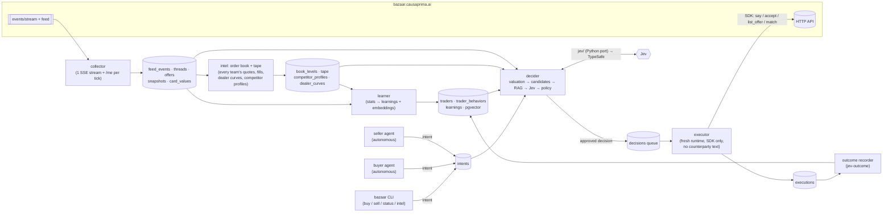

# 01 — PRD & Architecture Spec (master plan, part 1 of 2)

- Status: **DRAFT — awaiting human approval** (reply `approved` or `change: <details>`)
- Date: 2026-10-02 (Friday, game hour 0.32, tick 17)
- Traces to: kickoff briefing (`docs/briefing.md`), `vendor/bazaar-kit/RULES.md`, the repo specs (`.ai/specs/*-spec.md`; GitHub issues #1–#24 were migrated there and closed on 2026-10-03, archive in `docs/issues-archive.md`)
- Part 2 (phases, backlog, steps): [`02-plan.md`](./02-plan.md)
- Language: **Python only.** No `.ts` or `.rs` in our code. Jev is ported to Python (§6.3);
  `vendor/jev-sdk/` stays as the reference implementation and a test oracle, never a runtime dependency.

## 1. Goal

Win the Causa Prima hackathon. The score is 30 negotiating + 30 market-making (leaderboard) + 40
judges (pitch and craft). We build an autonomous trading system that runs unattended for every open
hour of the game. It keeps a memory of every card, trader and behaviour it sees, turns that memory
into **learnings**, and uses the learnings together with the Jev judge to decide each move. A
separate executor runtime then carries out each decision through the official Python SDK.

The dominant constraint: **never close outside our own limit, and never trust a counterparty's
words**. Only the structured offer binds. Every decision must be explainable after the fact (pitch).

## 2. Non-goals

- No LLM in the execution path. The executor is deterministic and never reads counterparty text.
- No price-moving prompt injection against dealers (it does not move prices and earns cool-offs).
- No wash trading, no second key, no feeding another team (suspension, bond slash).
- No custom HTTP client while the SDK works. Raw HTTP is Plan B only (see §6.2).
- No UI beyond a CLI and a read-only status view for now; a dashboard is a P2 nice-to-have (#15).
  The voice interface (ElevenLabs) comes later, and today we only keep the seam for it (§7.9).
- No TypeScript or Rust, and no `bun` at runtime.

## 3. Architecture

Five long-running processes share one Postgres (with pgvector). They talk only through tables,
never through shared memory, so any process can crash and restart without losing state.



The lifecycle of one move (the user's 5.1 → 6):

1. **Request (5.1).** A CLI command (`bazaar buy LAV-09 --max 90`) or an autonomous agent writes an
   *intent* row: what we want, a hard limit, and a deadline in game ticks.
2. **Memory (5.2).** The collector has already stored everything the game emits: our state each
   tick, every public feed event, every message in our threads.
3. **RAG (5.3).** The decider builds a compact state for the move: our album needs and reserve
   prices (SQL), the counterparty's behaviour profile (SQL aggregates over `trader_behaviors`), and
   the top-k most similar past episodes and learnings (pgvector). This is the "state of the
   learnings" that Jev sees.
4. **Decision.** Deterministic code produces the legal candidate moves inside hard limits. Jev
   picks among them (`negotiation_move`, `offer_is_worth_accepting`, …). Policy merges both and
   writes a `decisions` row with every input, verdict and reason.
5. **Execution (6).** The executor is a separate process with a fresh context. It claims an
   approved decision, re-reads live state, re-checks every invariant, and executes through the SDK.
   It only sees the structured decision, never the counterparty's words, which also makes it our
   prompt-injection firewall (#24).
6. **Feedback.** Settlements come back through the collector; the learner updates trader profiles
   and learnings; `jev-outcome` records whether each verdict was right.

## 4. Components

Python 3.12 package managed with `uv`, at `src/bazaar_agent/`. The vendored kit stays untouched
under `vendor/bazaar-kit/` and is imported via `sys.path`, the way `tests/test_bazaar_kit.py` does.

| Module | Responsibility |
|---|---|
| `config.py` | Load and validate env at startup: `BAZAAR_URL`, `BAZAAR_KEY`, `TYPESAFE_API_KEY`, `DATABASE_URL`, `DRY_RUN`, `PAUSED`. Fail fast if one is missing. |
| `client.py` | The only door to the game. Wraps the SDK `Bazaar`/`Broker`, adds a token bucket per process, maps `BazaarError` codes to typed outcomes. Plan B raw HTTP lives here and nowhere else. |
| `models.py` | Pydantic models for every response we depend on (`me`, `thread`, `offer`, `clock`, `book`, `duel`). External data is validated here, at the boundary. |
| `collector.py` | One SSE stream (`/api/events/stream?scope=team`), `/api/feed` read once per tick (no cursor: only the last 500 events, so gaps cannot be backfilled — capture continuously), `/api/me` + `/api/clock` once per tick. Writes raw rows only. |
| `intel/` | The live game read as a trading system's order book (§7.8). `book.py` rebuilds the book per card and venue from `offer.listed` / cancels / expiries / settlements. `tape.py` keeps prints with last, VWAP and volume per card. `dealer_curves.py` reconstructs every dealer thread, ours and other teams', as ask → counter → final → fill. `competitors.py` profiles each team. |
| `memory/` | `schema.sql` (migrations), `repo.py` (repository per table), `embed.py` (local embeddings), `retrieve.py` (SQL profile + vector top-k → compact RAG context). |
| `learner.py` | On every closed thread / settlement / duel: recompute trader stats, write or supersede `learnings`, embed them. |
| `valuation.py` | Reserve prices: `book × affinity × marginal[n]` (verified in #23), page and master bonus, what a card is worth to a counterparty who is missing it. |
| `jev/` | Python port of the Jev SDK's runtime half: `judge.py` (request, per-type verdicts, stakes thresholds, rate-limit retries inside one deadline), `mask.py` (redaction before anything leaves the machine), `log.py` (masked JSONL decisions + outcomes in `.local/jev-decisions`, same format as upstream), `report.py` (calibration). `questions/*.json` packs are shared unchanged. |
| `decide/` | `candidates.py` (legal moves inside limits), `policy.py` (merge Jev verdicts with guardrails, write the decision). |
| `service.py` | The command layer: `status()`, `buy()`, `sell()`, `intel()`, `learnings()`, `pause()`, … as plain functions returning pydantic models. The CLI calls them today and the voice interface will call them later (§7.9). |
| `agents/` | `buyer.py`, `seller.py`, `ladder.py` (Abuela and later dealers), `duelist.py`, `broker.py`. Each produces intents or, for the broker, match decisions. |
| `executor.py` | Claims approved decisions (`FOR UPDATE SKIP LOCKED`), re-validates, executes, records. The only process that writes to the game. |
| `words.py` | The text that goes with a structured offer. Templates first (kind, varied, never the same words twice without a new price); an LLM is optional later. |
| `cli.py` | `bazaar status | buy | sell | intel | learnings | decide --dry-run | approve | pause | resume | kill | run <process>`. |

Deliberately **not** abstracted: one game, one key, one database. No plugin system, no generic
"exchange" interface, no message bus beyond Postgres `LISTEN/NOTIFY`.

## 5. Data model

Postgres 17 with `pgvector` (`pgvector/pgvector:pg17` in `docker-compose.yml`). Embeddings are
384-d, computed locally (§7.5). All ticks are game ticks, never wall-clock time.

```sql
-- Reference data (from /api/catalog, /api/dealers; refreshed on level/set events)
cards(id text pk, set_code text, name text, rarity text, book numeric, print_run int,
      minted int, released bool, updated_tick int)
traders(id text pk, kind text check (kind in ('dealer','team','bench','rival_alias')),
        name text, level int, traits jsonb, menu jsonb, unlock jsonb,
        first_seen_tick int, last_seen_tick int)

-- Raw memory (append-only; the collector is the only writer)
feed_events(id bigint pk, tick int, type text, actor text, payload jsonb, received_at timestamptz)
threads(id bigint pk, counterpart text references traders, kind text, topic jsonb, venue text,
        status text, opened_tick int, closed_tick int, closed_reason text, ours bool)
messages(id bigint pk, thread_id bigint, sender text, tick int, text text, price int,
         offer jsonb, final bool, embedding vector(384))
offers(id bigint pk, thread_id bigint null, maker text, to_ text, venue text, give jsonb,
       want jsonb, created_tick int, expires_tick int, final bool, status text)
snapshots(tick int pk, cash int, level int, assets jsonb, album jsonb, score jsonb)
card_values(card_id text, tick int, your_value numeric, copies int, primary key (card_id, tick))

-- Behaviour memory (learner writes; one row per observed move)
trader_behaviors(id bigserial pk, trader_id text, thread_id bigint, tick int,
                 event text,          -- open | counter | concede | hold | final | walk | deal | cooloff | lie_suspected
                 our_price int, their_price int, step int, final bool,
                 words_match_structure bool,  -- false = text claims differ from the structured offer
                 source text,          -- ours | feed (other teams' threads, #21)
                 embedding vector(384))

-- Market intel: the live game as an order book (intel/ writes; rebuilt from feed_events)
book_levels(venue text, card_id text, side text check (side in ('bid','ask')), price int,
            offer_id bigint pk, maker text,     -- real team id from the feed; board shows a pseudonym
            created_tick int, expires_tick int, status text)
tape(settlement_id bigint pk, tick int, venue text, persona text null, buyer text, seller text,
     items jsonb, card_id text null, price int, fee int)
dealer_curves(thread_id bigint pk, dealer text, team text, item text, opening_ask int,
              asks int[], bids int[], final_ask int null, outcome text, fill_price int null,
              steps int, ticks int)
competitor_profiles(team text pk, updated_tick int,
                    set_interest jsonb,          -- buys/asks per set → inferred 1.6 and 0.5 sets
                    avg_pack_price numeric, dealer_deal_rate numeric, concession_style jsonb,
                    listings jsonb, fills jsonb, level int, venue text null, notes jsonb)

-- Learnings: what we believe, with evidence and confidence
learnings(id bigserial pk, scope text,      -- trader | card | market | duel | bench
          subject text,                     -- e.g. 'abuela', 'LAV-09', 'bench'
          claim text,                       -- "Abuela accepts sobre_barrio at <=22 after 4 steps"
          stats jsonb,                      -- numbers behind the claim
          support_n int, confidence numeric, created_tick int,
          superseded_by bigint null, embedding vector(384))

-- Decisions and execution
intents(id bigserial pk, source text, kind text, target jsonb, hard_limit int,
        deadline_tick int, status text, created_tick int)
decisions(id bigserial pk, intent_id bigint, thread_id bigint null, tick int,
          state_digest text, rag_context jsonb, candidates jsonb, jev jsonb,
          jev_digest text, policy_checks jsonb, chosen jsonb,
          status text check (status in ('proposed','approved','rejected','claimed','done','failed','expired')),
          reason text)
executions(id bigserial pk, decision_id bigint, tick int, sdk_method text,
           request jsonb, response jsonb, error_code text)
outcomes(decision_id bigint pk, realized_surplus numeric, ladder_share numeric,
         jev_right bool, recorded_tick int)
```

Invariants: `decisions.chosen` price never exceeds `intents.hard_limit` (buy) or goes below it
(sell), checked by both policy and executor. One executor claim per decision. A decision expires at
`deadline_tick`. Indexes: `trader_behaviors(trader_id, tick)`, `messages(thread_id, tick)`,
`feed_events(tick)`, HNSW on every `embedding` column.

## 6. Interfaces / API

### 6.1 SDK first

Every game call goes through `client.py` → vendored `bazaar_sdk.Bazaar` (team key) or `Broker`
(broker key). Routes that a level adds mid-game use `Bazaar.call(method, path, body)`, which is
still the SDK. Construct the SDK with `wait_on_tick=False`: the governor owns tick timing, so one
`wait_for_tick` cannot block a whole process for up to 65 s.

### 6.2 Plan B: raw HTTP, validated against the OpenAPI spec

Used only when the SDK lacks a route or misbehaves, and logged as `plan_b` each time:

- `GET /api/events/stream` (SSE). The SDK has no streaming method, so the collector needs `httpx`
  streaming here from day one.
- Any SDK bug we confirm (for example `wait_tick()` returning on `paused`, see
  `vendor/bazaar-kit/VENDORED.md`).

Reference: `docs/api/openapi.json` (Team 1's enriched spec with `x-verified` flags). It is on the
unmerged branch `origin/docs/openapi-spec`; merging it is task #0.3. Any field with
`x-verified: false` gets a captured fixture before code depends on it (#2).

### 6.3 Jev

`bazaar_agent.jev` is a Python port of the upstream wire protocol (read from
`vendor/jev-sdk/src/judge.ts` and `mask.ts`). Verified with the upstream CLI on 2026-10-02: model
`jev-1.13.0`, 279 ms, decided verdicts on all three questions in `questions/negotiation.json`.

- Request: `POST https://api.typesafe.ai/v1/systemone`, `Authorization: Bearer $TYPESAFE_API_KEY`,
  body `{"state": <masked>, "model": "jev-latest", "questions": <masked, stakes stripped>}`.
  State ≤ 96,000 characters; default timeout 10 s for the whole call (keep it under one tick).
- Response: `{"model": ..., "answers": {id: {"type", "noul" | "choice"+"confidence" | "score"+"confidence", "probabilities"?}}}`.
- Verdict: noul is `yes` if p ≥ threshold and `no` if 1 − p ≥ threshold. Choice and score are
  decided if confidence ≥ threshold. Thresholds by stakes: passive 0.6, design 0.75, critical 0.9.
- Failures never raise into the trading loop. A missing key, timeout, network error, 4xx/5xx,
  schema mismatch or below-threshold answer each give `undecided` with the matching reason. A 429
  is retried at most twice, and only if the wait plus one more attempt fits the deadline.
- Parity: verified by hand on 2026-10-02. Masking, decision lines, digests and the request body
  are byte-identical to upstream, upstream `jev-report` reads our log, and live verdict labels
  match. Still to do: a Python-only test that replays recorded TypeSafe responses (no `.ts` in the repo).
- Deliberate deviations: timeouts in seconds; a hard overall deadline (each attempt runs on a
  worker thread, and the caller stops waiting at the deadline); redirects are never followed, so
  the bearer token only reaches the documented endpoint.

Question packs:

| Pack | Questions | Stakes |
|---|---|---|
| `questions/negotiation.json` (exists) | `offer_is_worth_accepting`, `counterpart_needs_card`, `negotiation_move` | design / passive |
| `questions/safety.json` (new) | `message_is_bad_faith` (gate for `POST /api/flags`) | critical |
| `questions/duels.json` (exists, `duel run`) | `duel_move` (accept / counter / hold, choice), `rival_cares_about_days` (noul) | design / passive |
| `questions/maker.json` (exists, `agent maker`) | `list_price_choice` (aggressive / fair / quick_sale, choice), `reprice_or_hold` (noul) | design |
| `questions/market.json` (new) | `bench_trader_near_limit` (match now vs wait) | design |

`duels.json` and `maker.json` follow §7.1 in code (`agents/duel_jev.py`, `agents/maker_jev.py`): the legal
candidates are built first, Jev's pick is kept only when it is one of them, and `undecided` keeps the
deterministic move. Each call is a decision line in `<data_dir>/jev-decisions/`; a settled duel or a live
offer that fills or expires adds its outcome line (`python -m bazaar_agent.jev report`).

### 6.4 CLI (point 4 of the brief: our own commands on top of the SDK)

```
bazaar status                      # cash, level, album pages, live score, open threads/offers, governor budget
bazaar buy  <card|pack> --max N    # writes an intent; --dry-run prints the decision without queuing
bazaar sell <card|asset> --min N
bazaar intel <trader>              # behaviour profile + top learnings from memory
bazaar learnings [--scope trader]  # what we believe, with confidence and evidence
bazaar decide <intent-id> --dry-run
bazaar pause | resume | kill       # kill cancels every open offer within 1 tick (#3)
bazaar run collector|learner|decider|executor|buyer|seller|broker
```

Agent-facing wrappers (sources under `.ai/`, fanned out by `sh scripts/sync-ai-docs.sh`):
`.ai/skills/bazaar/SKILL.md` (how to operate the system: SDK first, Plan B rules, limits, never
print keys, how to read learnings and Jev logs) and `.ai/commands/bazaar-{status,buy,sell,intel,learn}.md`.

## 7. Key decisions & algorithms

### 7.1 Jev informs, hard limits authorize

```
candidates = legal_moves(state)                 # inside hard_limit, cash, ownership, tick budget
verdict    = jev(state + rag_context, questions)
if verdict.decided and verdict.choice in candidates: chosen = verdict.choice
else: chosen = conservative_default(candidates)  # undecided is never "yes"
assert within_limits(chosen)                    # policy check, repeated by the executor
```

`conservative_default`: never accept, never flag. Counter by the smallest step the trader rewards
(learned), or hold. At 15 s ticks there is no human in the loop, so `undecided` maps to the safe move,
not to a stop. This keeps the rule in `.ai/skills/jev/` that a verdict never authorizes an action.

### 7.2 What scores, and what we optimise for each

| Block | Lever | Our move |
|---|---|---|
| Ladder (neg. 30) | Share of each dealer's price range captured, best 3 deals per level | Buy close to the dealer's hidden limit. Learn its concession curve from **other teams' public threads** (#21) before spending our hourly quota. |
| Trades (neg. 30) | Surplus at private values | Sell duplicates and low-affinity cards (LAT ×0.5) to teams that need them; buy LAV ×1.6 / SAL ×1.3 (#23). |
| Duels (neg. 30) | Share of the pie, 0 outside limit | Hard floor at our limit; anchor and decay policy (#5); learn rival profiles from practice (#4). |
| Market (30) | Market Test efficiency + organic value on our venue | `board` venue + broker that estimates hidden limits from quote shading and patience (#11, #12). Needs level 2. |
| Judges (40) | Ideas and craft | This architecture: memory → learnings → Jev → fresh executor, framed for agent-to-agent invoice negotiation (#16). |

Corrected by the rules audit (Sat 3 Oct, commit 8dbf50b7; full text in `docs/briefing.md` "Scoring" and `STRATEGY.md` "What scores"):

- Holding cards, the album and `collection_value` never score by themselves. A card scores only when it moves: a team trade (price minus our `your_value`, into `neg_points`) or a dealer deal (ladder share of that dealer's own range, buying or selling; the opening price scores 0 and the dealer's final scores the whole range).
- Per round, market-making is about 22.5 × `bench_points` + 7.5 × organic, and negotiating is about ladder 7.5 + duels 7.5 + team trades 15, each part capped at the top-3 mean. The ladder restarts every round.
- A round starts on the organisers' `round` action in `/api/schedule` (round 2 at tick 160, round 3 at game hour 16.65, about Sun 11:34), not when the doors open.
- Page cards still cost points when sold: team-acquired page cards are marked at the current `your_value`, so breaking a complete page dropped `neg_points` 134.7 → 44.6 (Sat 3 Oct, tick 948). Hence the hard rules in `.ai/context.md`.

### 7.3 Level 2 is the gate to 30 points

Abuela's `unlock.early_min_deals = 3`: three negotiated deals (not at her opening price) unlock the
next level early, and level 2 is needed to open a venue. Tonight's first job for the system is
three negotiated Abuela deals, preferably packs with LAV/SAL upside.

### 7.4 "Going around Madrid": collect first

We start with 11 commons, 3 uncommons and 1 rare (`/api/me`). The buyer agent first fills pages
with the best value per prima: high-affinity sets (LAV, SAL), cheap commons from Abuela at ≤10, and
packs while she sells 3 per hour. A page does not score by itself (§7.2); it raises what each of its
cards is worth to us, and a trade is scored against that value. The seller agent lists only true
duplicates whose value to us is far below their value to a likely buyer, and never our only copy of a
page card (`protect_page_sets`). Each new set (RET Saturday, CHA Sunday) re-runs the collect plan.

### 7.5 Embeddings and what the vector store is for

Local model through `fastembed` (multilingual, 384-d, CPU, no extra key; exact model to confirm at
build time). The vector store retrieves **analogous episodes and learnings** ("dealer that held
its price twice then dropped 3"). The numbers that move money (concession steps, limits, reserves)
come from SQL aggregates, not from similarity search. Both go into the RAG context, and the numbers
take precedence.

### 7.6 Rate budget

5 req/s per key, bursts of 20. Fixed shares per process: collector 1.5 r/s (plus one SSE stream),
decider 1 r/s (reads mostly come from the DB), executor 2 r/s, broker 0.5 r/s. Per-tick game
limits (1 accept, 1 message per thread, 12 listings) are re-read from `/api/clock.limits` every
tick and enforced by the executor, which is the only writer.

### 7.6b Tick budget per decision (no late sends)

| Day | Tick | Action budget (`ticks.action_budget_s`) | Jev timeout | Max decisions per tick |
|---|---|---|---|---|
| Fri | 60 s | `next_tick_in` − 2 s | 3 s | 6 threads × 1 message, 1 accept |
| Sat | 30 s | `next_tick_in` − 2 s | 3 s | same |
| Sun | 15 s | `next_tick_in` − 2 s | 2 s | same; Jev only for accepts and finals |
| fastest (5 s) | 5 s | `next_tick_in` − 0.75 s | skip Jev, conservative default | 1 accept |

The loop: on each new tick read the clock, then the state (`/api/me`, threads) once. Decide every
open thread inside the budget, Jev calls included (run concurrently, 1 call per decision). Hand the
approved decisions to the executor, which sends them in priority order (duel > accept > dealer
counter > listing) and stops at the per-tick limits. Anything not sent when the budget hits 0 is
dropped and re-decided next tick on fresh state. Dealer offers expire after 2 ticks, so a counter
is re-sent at least every 2 ticks or the thread goes quiet.

### 7.7 Unattended running ("24/7")

The game only ticks Fri 19–23, Sat 09–23 and Sun 09–15. The services run continuously anyway:
`docker compose` with `restart: unless-stopped`. They sleep while `clock.doors == "closed"` and wake
at `next_opens`. They write a heartbeat row every tick, and a human starts and stops them.

### 7.8 The live game is an order book: learn the competition from it

`GET /api/feed` and the SSE stream are public, and they carry the structure of nearly everything,
so we treat them like the market-data feed of a trading system. Sample of 150 events at tick 17:
107 `thread.message` (57 of them Abuela's counters to other teams), 15 `offer.listed`
(with the **real team id**, while the venue board shows only pseudonyms), 12 `settlement` (with
price), 11 `thread.opened` (team + topic), 4 `pack.opened`, 1 `gift.given`. Message text is null,
and only the structure is published.

| Trading-system concept | Bazaar source | What we learn |
|---|---|---|
| Order book (L2 per card) | `offer.listed` minus cancels, expiries, fills; `board(venue)` | Best bid/ask and depth per card. Where to list our duplicates, and who is already selling what we want. |
| Trade tape | `settlement` (parties, items, price, fee) | Fair price per card and per pack. Abuela's packs filled at 17–24 against list 26 and opening ask 30, so the price range she gives up is now measurable. |
| Market-maker quotes | Abuela's `thread.message` offers to every team | Her concession curve, step sizes, when she goes `final`, and the price at which she fills, all without spending our hourly quota. This feeds the ladder share. |
| Flow / positioning | Each team's thread topics, listings, fills | Each team's **inferred affinities**. Every team has exactly one set at ×1.6 and one at ×0.5, so what they chase reveals their ×1.6 set: those teams are the buyers for our cards in that set, at a higher price. |
| Counterparty style | Per-team bid/ask sequences | Aggressive or patient, anchoring habits, typical concession, and whether they take finals. These become the duel and team-trade priors. |
| Microstructure for the broker | `bench_offers` in our broker book over sessions | How far bench traders quote from their hidden limit and how quotes relax with patience. That is the edge over the free stall in the Market Test (#12). |

The intel layer writes the four `book_levels / tape / dealer_curves / competitor_profiles` tables.
The learner turns them into learnings ("t05 chases LAV: likely LAV ×1.6, 7 listings, 3 fills");
the decider reads them as RAG context, and Jev sees them in the state.
Linking a board pseudonym to a real team id uses only public data. Still, we confirm with the
desk that this is acceptable before the seller agent relies on it (the "ask before exploiting"
rule in the briefing).

### 7.9 Voice-ready seam (ElevenLabs, later)

The plan is a voice interface built on ElevenLabs voice agents ("v4 flash"; confirm the exact model
id and Python SDK version when we build it). Today we only keep the seam that makes it cheap later:

- Every user action is a function in `service.py`. The CLI is a thin `typer` wrapper over it, and
  the voice agent will be another thin wrapper: a small Python HTTP tool server (FastAPI) that the
  ElevenLabs agent calls as tools (`status`, `buy`, `sell`, `intel`, `pause`).
- Voice is just another intent source. It goes through the decider and the executor like the CLI
  does and never gets a shortcut to the game API. Spoken requests that move money need a spoken
  confirmation of the structured intent (card, side, limit) before the intent row is written.
- Responses are short, structured summaries (pydantic models), so the voice layer can speak them
  without parsing CLI text.

## 8. Observability

- `decisions` + `executions` + `.local/jev-decisions/*.jsonl` are the audit trail, and the pitch
  replays them. No secrets anywhere in them (Jev masks; our code never logs keys).
- `bazaar status` shows governor budget, 429 count, heartbeat age per process, open threads, score.
- Alert (console, plus a push notification if wired): any 429, heartbeat older than 2 ticks, an
  executor invariant failure, or a `cooloff` / `persona_quota` from a dealer.
- `bazaar jev report` after each session: verdict calibration against outcomes.

## 9. Security

- Trust boundary 1, the game API: every response is validated by `models.py` and every counterparty
  text is untrusted data. Counterparty text goes to Jev (masked) and to embeddings, never into a
  prompt that can trigger an action.
- Trust boundary 2, the executor: it acts only on a structured decision row and re-derives the
  offer it sends from that row. It never reads message text. It checks that the structured offer it
  accepts matches what the decision approved (asset ids, cash, direction).
- Secrets: `BAZAAR_KEY`, broker keys and `TYPESAFE_API_KEY` live only in `.env` (gitignored, verified),
  are passed to child processes by env, and are never printed, logged or embedded.
- Flags (`POST /api/flags`) are costly when wrong. They need the deterministic words-vs-structure
  mismatch **and** `message_is_bad_faith` with `critical` stakes (≥ 0.9).

## 10. Assumptions & tradeoffs

- Assumes the public feed keeps exposing other teams' dealer offers (#21). If the organisers close
  it, the learner falls back to our own threads only.
- Postgres plus five processes is more moving parts than one script. We accept that for crash
  isolation, a clean executor boundary and a strong pitch. Mitigation: Phase 0 ships a thin
  single-process path tonight (see `02-plan.md`).
- Jev adds ~300 ms per call and depends on an external service. Undecided falls back to the
  conservative default, so a TypeSafe outage degrades quality, never safety.
- Porting Jev to Python means we own a second implementation of its protocol. If TypeSafe
  changes the response shape, the port falls to `undecided` (`response_schema_mismatch`), which is
  safe. Parity fixtures catch drift when the vendored SDK is re-copied.
- The value formula (#23) is verified for marginal copies. Page and master bonuses are still unverified.

## 11. Open questions

1. **Team key.** `.env` holds only `TYPESAFE_API_KEY`; there is no `BAZAAR_KEY`, so `/api/me` cannot
   be called from this checkout yet. Someone already used it (#23). Add it to `.env` as `BAZAAR_KEY`.
2. **Where it runs unattended.** A laptop sleeps. Options: a laptop with `caffeinate` (Friday) or an
   always-on host such as Railway (from Saturday). It still counts as one key and one team.
3. **Words.** Templates only, or an LLM for message text (Claude Haiku 4.5 is cheap and fast)?
   Templates are enough for Abuela; duels may benefit from an LLM.
4. **Merge `docs/openapi-spec`** into main so Plan B has its reference on the default branch.
